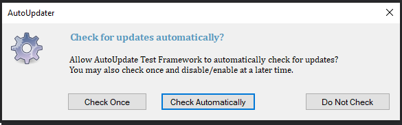
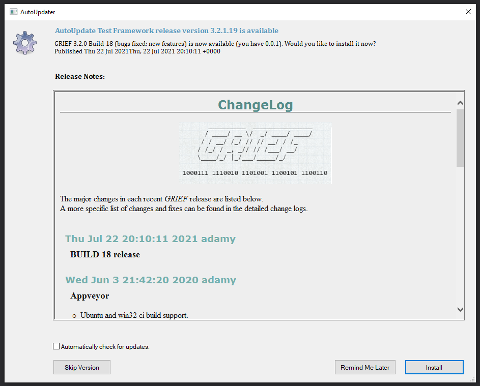
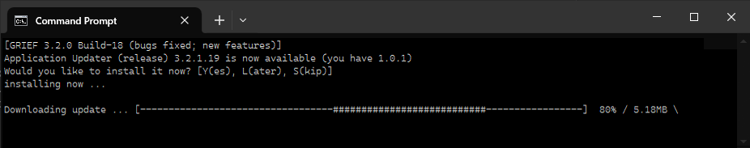
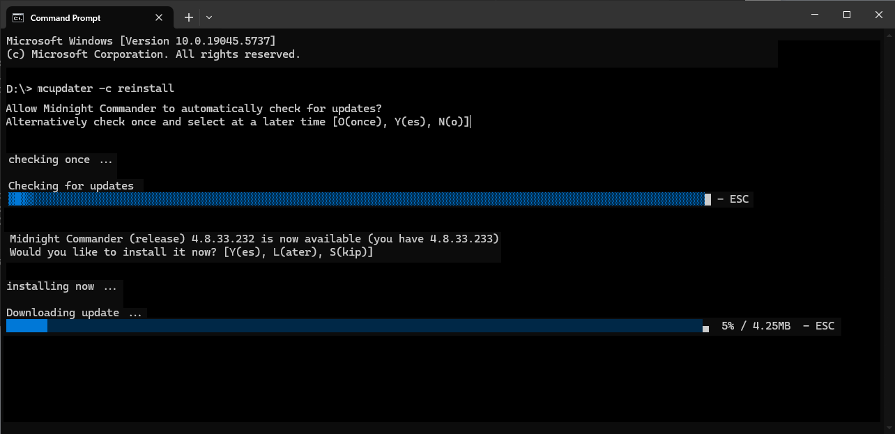

# libappupdater

<p align="center">Windows application updater library, similar to Sparkle and WinSparkle. The library checks for updates from a remote server or file-system, which inturn notifies the user of your apps' update and prompts an optional installation. This process can be executed periodically within your application with limited user interaction.</p>

<p align="center">It is a win32 native stand-alone library without any non-system external dependencies, permitting both GUI and console interaction.<p>
<p align="center">Due to minimal external dependencies supports MSVC 2008+ and OpenWatcom and run on Windows XP or greater.
Other toolchains should be possible with minimal effort.</p>

### Graphic Interface





### Console Interface





## EdDSA (ed25519) signatures

As the updater is downloading an installer from a remote location, security must be considered.

By default for data integrity the installer is signed using both MD5 and SHA hashes, for greater security installers can also be signed using a [EdDSA and Ed25519](https://cryptobook.nakov.com/digital-signatures/eddsa-and-ed25519) signature.

## KeyGen

To prepare signing with EdDSA signatures, run _keygen_ (from the package distribution), this action only needs to be performed once. Keygen shall generate both a private key and associated public key as pem style file images.  The private key is required to sign an installer whereas the public key is used to verify.

```
keygen -K application_private.pem -k application_public.pem
```

These files should be stored securely in a non public location. If the private-key is lost, you wont be able to recover the key and shall be unable to issue new releases under the same key. A new key-pair and associated key-version shall need to generated.

It shall also display the public key encoded as a base64-encoded string, which is required to embed into your updater applications. The key files shall be needed when generating an application signature block.

```
 Generating <private.pem> and <public.pem>
 A key-pair has been generated and saved locally.
 Add the following public-key into your updater application.

      "VVAqoUagyW3ZfSt+7RfrGHFFY301CEkismrVJtxFjfU="
```

Rerunning _keygen_ shall only load any local pem images and redisplay the public key.

## SignTool

To sign an installer, the _SignTool_ application is run, for example

```
signtool -K application_private.pem -x 1 -v 0.0.1 \
   -H https://github.com/user/repo~application.manifest application-installer-0.0.1.exe
```

The resulting signature block is exported that can then by cut & pasted into the application manifest,
which you can value add to include a change notice related to the installer release.

```xml
<title></title>
<link></link>
<description></description>
<published>1745138422</published>
<pubDate>Sun, 20 Apr 2025 16:40:22 +0000</pubDate>
<enclosure url="https://github.com/user/repo~application.manifest"
   os="windows"
   name="application-installer-0.0.1.exe"
   version="0.0.1"
   length="4651716"
   md5Signature="d2a2be2f3175c01b586eee68030bd61e"
   shaSignature="a805501b9913b6efcf2981ab468b0007e687cde3"
   edSignature="Liza1uN/dECOIk+Hffp6wMqoZ9IxPGGwF2Vn61L2/LzxkGoTRMnJd5zg+A2E7Sl0gCTN/3R3SPp52Lbvn5qGCA=="
   edKeyVersion="1.1"
   type="application/octet-stream" />
```

### sign application integration

To simplifying application integration a customised version of _signtool_ can be built.
Using the provided application shim, default arguments can be provided stream-lining software management.

```C++
//
// signtool specialisation
//
#include "libappupdater/sign/signtoolshim.h"       // SignToolShim()

int
main(int argc, char *argv[])
{
   struct SignToolArgs args = {0};

   args.hosturl = "https://github.com/user/repo~application.manifest";
   
   return SignToolShim(argc, argv, &args);
}
```

## Example application.manifest

```xml
<?xml version="1.0" encoding="utf-8"?>
<manifest>
   <channel name="release">
      <title>Application Change Channel</title>
      <link>https://github.com/user/repo/release/latest</link>
      <description>Most recent changes with links to updates.</description>
      <language>en</language>
      <item>
         <title>Application 1.0.3, minor release</title>
         <description><![CDATA[
<style media="screen" type="text/css">
body { font: 80%/1.5em Verdana, Tahoma, arial, Sans-serif; background: #ECECEA; color: #333; }
h1   { font: Bold 150% Verdana, 'Trebuchet MS', Sans-serif; color: #558C89; text-align: center; border-bottom: 1px solid #000000; }
h2   { font: Bold 120% Verdana, 'Trebuchet MS', Sans-serif; color: #74AFAD; border-width: 0px; }
p    { margin: 0; padding: 10px 0 0 0; }
ul.a { list-style-type: circle; padding: 0px; margin: 0px; }
ul.b { list-style-type: square; padding: 0px; margin: 0px; }
</style>
<html><body>
      <h1>Change Log</h1>
      <p>
      The major changes for this <i>application</i> release are listed below.
      A more specific list of changes and fixes can be found in the detailed change log.
      </p>
      <ul>
            <li>Updater 1.0.3 integration.</li>
      </ul>
<body></html>
 ]]>
         </description>
         <published>1745138422</published>
         <pubDate>Sun, 20 Apr 2025 16:40:22 +0000</pubDate>
         <enclosure
          url="https://github.com/user/repo~application.manifest"
          os="windows"
          name="application-installer-1.0.3.exe"
          version="1.0.3"
          length="4651716"
          md5Signature="d2a2be2f3175c01b586eee68030bd61e"
          shaSignature="a805501b9913b6efcf2981ab468b0007e687cde3"
          edSignature="Liza1uN/dECOIk+Hffp6wMqoZ9IxPGGwF2Vn61L2/LzxkGoTRMnJd5zg+A2E7Sl0gCTN3R3SPp52Lbvn5qGCA=="
          edKeyVersion="1.1"
          type="application/octet-stream" />
      </item>
   </channel>        
</manifest>
```

## Integration

### Building

To build from source directly, you'll need to compile from a git checkout.

```
   git clone https://github.com/adamyg/libappupdater
   $ cd libappupdater
```

Note: Generally _libappupdater_ would be a submodule within the application repo.
   
To compile the library, just open within Visual Studio one of bundled AutoUpdater.xxx.sln solutions (atching your corresponding compiler version) and build it. Alternatively run __msbuild__ against the same solution.

```
   msbuild AutoUpdater.vs160.sln /property:Configuration=Release
   msbuild AutoUpdater.vs160.sln /property:Configuration=Debug
   msbuild AutoUpdater.vs160.sln /property:Configuration=Release  /p:Platform=x64
   msbuild AutoUpdater.vs160.sln /property:Configuration=Debug    /p:Platform=x64
```

### Updater application integration

Application integration can be achieved using several methods.

   - As a stand-alone updater application; or
   - embedded within the target application.

Working examples are provided as test applications. For following demonstrates one method

#### Standalone integration:

```C++
#include "libappupdater/update/updatetoolshim.h"   // UpdaterToolShim()

#include "version.h"                               // VERSION_TAG, build-system version.
#include "public_key.h"                            // PUBLIC_KEY and KEY_VERSION, see: keygen

int
main(int argc, char *argv[])
{
   struct UpdateToolArgs args = {0};

   args.progtitle = "MyApplication updater";

   args.appname = "MyApplication";
   args.version = VERSION_TAG;
   args.hosturl = "https://github.com/user/repo~application.manifest";
  
   args.publickey = PUBLIC_KEY;
   args.keyversion = KEY_VERSION;     
  
   return UpdateToolShim(argc, argv, &args);
}
```

#### Embedded integration:

```C++
#include "libappupdater/src/AutoUpdater.h"         // AutoUpdater

#include "version.h"                               // VERSION_TAG, build-system version.
#include "public_key.h"                            // PUBLIC_KEY and KEY_VERSION, see: keygen

int
Application::CheckForUpdates()
{
   AutoUpdater au;

   // Note parameters stated either by:
   //    o Explicit run-time arguments; or
   //    o Application resource elements, alone-side VERSIONINFO information; 
   //    see AutoConfig.h for further details.
   //
   au.EnableDialog();

   au.AppName("MyApplication");
   au.AppVersion(VERSION_TAG);

   au.HostURL("https://github.com/user/repo~application.manifest");
   au.PublicKey(PUBLIC_KEY, KEY_VERSION);

   au.Execute(AutoUpdater::ExecuteAuto, true);
}
```

## License

      MIT License

      libappupdater, Copyright (c) 2012 - 2025 Adam Young
      https://github.com/adamyg/libappupdater

      Permission is hereby granted, free of charge, to any person obtaining a copy
      of this software and associated documentation files (the "Software"), to deal
      in the Software without restriction, including without limitation the rights
      to use, copy, modify, merge, publish, distribute, sublicense, and/or sell
      copies of the Software, and to permit persons to whom the Software is
      furnished to do so, subject to the following conditions:

      The above copyright notice and this permission notice shall be included in all
      copies or substantial portions of the Software.

      THE SOFTWARE IS PROVIDED "AS IS", WITHOUT WARRANTY OF ANY KIND, EXPRESS OR
      IMPLIED, INCLUDING BUT NOT LIMITED TO THE WARRANTIES OF MERCHANTABILITY,
      FITNESS FOR A PARTICULAR PURPOSE AND NONINFRINGEMENT. IN NO EVENT SHALL THE
      AUTHORS OR COPYRIGHT HOLDERS BE LIABLE FOR ANY CLAIM, DAMAGES OR OTHER
      LIABILITY, WHETHER IN AN ACTION OF CONTRACT, TORT OR OTHERWISE, ARISING FROM,
      OUT OF OR IN CONNECTION WITH THE SOFTWARE OR THE USE OR OTHER DEALINGS IN THE
      SOFTWARE.
